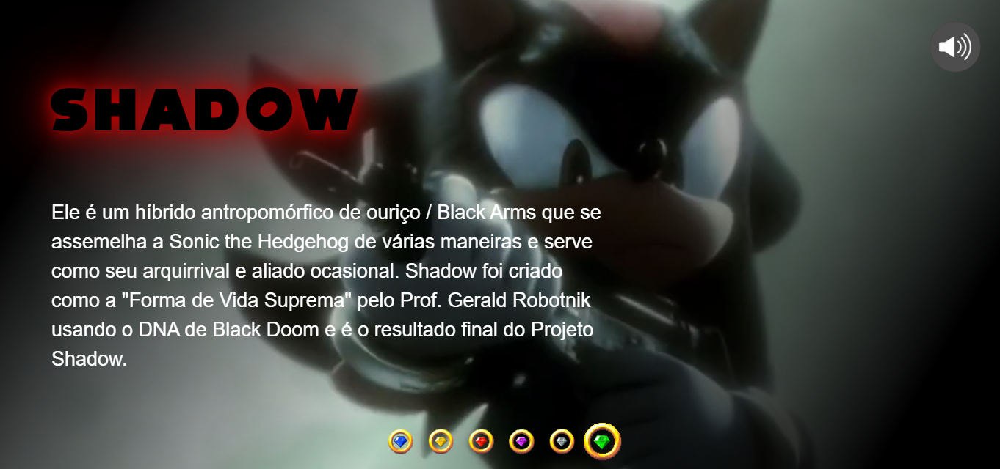

# Segundo projeto de Sonic da base do front-end estilo Netflix

imagina você indo para uma série, desenho ou filme e você vê um trailer do vídeo e depois que acaba o vídeo aparece uma imagem do post da série? O projeto se trata sobre exatamente isso, a questão é que fala sobre os personagens de Sonic enquanto passa um trailer no fundo do site

E se você quer acessar o site [clique aqui](https://bernardobmc567.github.io/Projeto-do-Sonic/) para acessar o resultado final!

